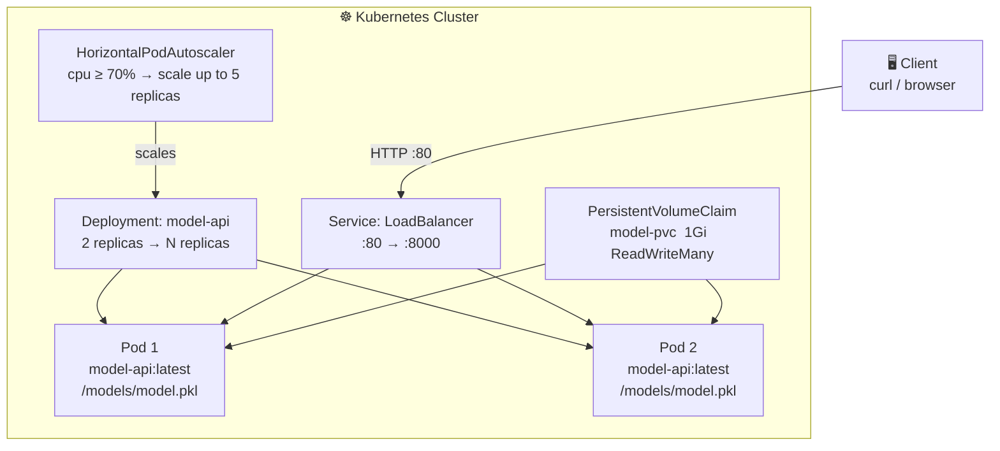

# Project 3 – Development Guide
## ML Deploy: Train → Serve → Scale (FastAPI + Docker + Kubernetes)

> **Goal:** Take a trained recommendation model all the way from raw data to a
> production-ready, containerised REST API with Kubernetes manifests for
> horizontal auto-scaling — step by step.

---

## Table of Contents

1. [Architecture Overview](#1-architecture-overview)
2. [ML Lifecycle Diagram](#2-ml-lifecycle-diagram)
3. [Kubernetes Deployment Diagram](#3-kubernetes-deployment-diagram)
4. [Directory Structure](#4-directory-structure)
5. [Step 0 — Prerequisites](#5-step-0--prerequisites)
6. [Step 1 — Data & Feature Engineering](#6-step-1--data--feature-engineering)
7. [Step 2 — Model Training](#7-step-2--model-training)
8. [Step 3 — FastAPI Inference Service](#8-step-3--fastapi-inference-service)
9. [Step 4 — Docker Packaging](#9-step-4--docker-packaging)
10. [Step 5 — Local Run with Docker Compose](#10-step-5--local-run-with-docker-compose)
11. [Step 6 — Kubernetes Deployment](#11-step-6--kubernetes-deployment)
12. [Step 7 — API Reference](#12-step-7--api-reference)
13. [Step 8 — Testing](#13-step-8--testing)
14. [Step 9 — CI/CD Pipeline](#14-step-9--cicd-pipeline)
15. [Configuration Reference](#15-configuration-reference)
16. [Troubleshooting](#16-troubleshooting)
17. [Extension Ideas](#17-extension-ideas)

---

## 1. Architecture Overview

```
┌──────────────────────────────────────────────────────────────────┐
│                        Project 3 Stack                           │
│                                                                  │
│  ┌─────────────────┐  model.pkl   ┌──────────────────────────┐  │
│  │    Trainer      │─────────────▶│      FastAPI App          │  │
│  │  (train.py)     │              │     /health  /predict     │  │
│  │                 │              │                            │  │
│  │  generate_data()│              │  ┌──────────────────────┐ │  │
│  │  train()        │              │  │  load_model()        │ │  │
│  │  save() → pkl   │              │  │  predict_proba()     │ │  │
│  └─────────────────┘              │  └──────────────────────┘ │  │
│        (Docker volume)            └────────────┬─────────────┘  │
│        model_data:/models                      │ :8000          │
│                                                │                │
│  ┌─────────────────────────────────────────────▼──────────────┐ │
│  │                 Kubernetes (minikube / kind)                │ │
│  │                                                            │ │
│  │  Deployment (2 replicas)  ◀──  HPA (cpu ≥ 70% → scale)   │ │
│  │      ↕ LoadBalancer Service :80 → :8000                   │ │
│  │      ↕ PersistentVolumeClaim (model.pkl)                  │ │
│  └────────────────────────────────────────────────────────────┘ │
└──────────────────────────────────────────────────────────────────┘
```

---

## 2. ML Lifecycle Diagram

```mermaid
flowchart TD
    subgraph Data["📊 Data Generation"]
        D1["generate_data&#40;n=5000&#41;"]
        D2["Features: user_id, item_id,\nhour_of_day, day_of_week"]
        D3["Label: 1=liked, 0=not liked\n&#40;rule + noise&#41;"]
        D1 --> D2 --> D3
    end

    subgraph Training["🧠 Model Training"]
        T1["LogisticRegression\n&#40;max_iter=200, seed=42&#41;"]
        T2["model.fit&#40;X, y&#41;"]
        T3["save → model.pkl"]
        T1 --> T2 --> T3
    end

    subgraph Serving["🚀 Model Serving"]
        S1["FastAPI startup\nload_model&#40;&#41;"]
        S2["POST /predict\n{user_id, item_id,\nhour_of_day, day_of_week}"]
        S3["predict_proba&#40;&#41;\npredict&#40;&#41;"]
        S4["{score: 0.62, label: 1}"]
        S1 --> S2 --> S3 --> S4
    end

    D3 -->|X, y| Training
    T3 -->|model.pkl| S1
```



---

## 3. Kubernetes Deployment Diagram



---

## 4. Directory Structure

```
project3-ml-deploy/
├── trainer/
│   ├── train.py           # data generation + training + save model.pkl
│   ├── requirements.txt   # numpy, scikit-learn
│   └── Dockerfile
├── app/
│   ├── main.py            # FastAPI app: /health, /predict endpoints
│   ├── requirements.txt   # fastapi, uvicorn, scikit-learn
│   └── Dockerfile
├── k8s/
│   ├── deployment.yaml    # Deployment (2 replicas) + PVC
│   ├── service.yaml       # LoadBalancer service
│   └── hpa.yaml           # HorizontalPodAutoscaler
├── tests/
│   ├── test_trainer.py    # unit tests – data gen, training, save/load
│   └── test_api.py        # unit tests – FastAPI endpoints (TestClient)
└── requirements.txt       # dev deps
```

---

## 5. Step 0 — Prerequisites

| Requirement | Version | Check |
|-------------|---------|-------|
| Docker + Compose v2 | ≥ 24 | `docker compose version` |
| Python | 3.10+ | `python --version` |
| kubectl (K8s deploy only) | 1.27+ | `kubectl version --client` |
| minikube or kind (K8s deploy only) | latest | `minikube version` |

```bash
cd de-ml-monorepo
cp .env.example .env
```

---

## 6. Step 1 — Data & Feature Engineering

The trainer uses **synthetic data** so no external datasets are needed.

### Feature design

| Feature | Range | Meaning |
|---------|-------|---------|
| `user_id` | 0 – 999 | Simulated user identifier |
| `item_id` | 0 – 499 | Simulated item identifier |
| `hour_of_day` | 0 – 23 | Hour of the request |
| `day_of_week` | 0 – 6 | Day of the week (0 = Monday) |

### Label rule

```python
# 1 = liked  when: user_id % 3  +  item_id % 2  + noise  > 2
y = ((X[:, 0] % 3 + X[:, 1] % 2 + rng.integers(0, 2, n)) > 2).astype(int)
```

This produces a balanced label (~50 % positive class) with controlled noise,
making it a good baseline for a binary classifier.

### To swap in real data

Replace `generate_data()` in `train.py` with a function that:
1. Reads from Postgres (Project 1's `raw_events`) or an S3 Parquet file
2. Applies the same feature column order: `[user_id, item_id, hour_of_day, day_of_week]`
3. Returns `(X: np.ndarray, y: np.ndarray)`

---

## 7. Step 2 — Model Training

**File:** `trainer/train.py`

### How to run

```bash
# Via Docker Compose (recommended)
docker compose --profile train run --rm trainer

# Locally
MODEL_PATH=/tmp/model.pkl python trainer/train.py
```

### What happens

```
generate_data(n_samples=5000)
    └── returns X (5000×4 float), y (5000,) int

train(X, y)
    └── LogisticRegression(max_iter=200, random_state=42).fit(X, y)
    └── returns trained model

save(model, MODEL_PATH)
    └── mkdir -p /models
    └── pickle.dump(model, f)
    └── prints "Model saved to /models/model.pkl"
```

The model is persisted on a **Docker volume** (`model_data`) so the API
container can read it without rebuilding the image.

### Evaluate the model (optional)

```python
from sklearn.metrics import classification_report
from trainer.train import generate_data, train

X, y = generate_data()
model = train(X, y)
print(classification_report(y, model.predict(X)))
```

---

## 8. Step 3 — FastAPI Inference Service

**File:** `app/main.py`

### Startup sequence

```
Docker starts → lifespan(app) → load_model()
    → reads MODEL_PATH env var
    → if model.pkl exists → load into _model
    → if not → _model = None (API starts but /predict returns 503)
```

### Endpoints

#### `GET /health`

```bash
curl http://localhost:8000/health
```

```json
{"status": "ok", "model_loaded": true}
```

#### `POST /predict`

```bash
curl -X POST http://localhost:8000/predict \
  -H "Content-Type: application/json" \
  -d '{"user_id": 1, "item_id": 50, "hour_of_day": 14, "day_of_week": 3}'
```

```json
{"score": 0.6213, "label": 1}
```

| Field | Type | Description |
|-------|------|-------------|
| `score` | float 0–1 | Probability of label = 1 |
| `label` | int 0 or 1 | Predicted class |

#### `GET /docs`

Swagger UI with try-it-out: **http://localhost:8000/docs**

---

## 9. Step 4 — Docker Packaging

### Trainer Dockerfile

```
python:3.10-slim
  └── pip install numpy scikit-learn
  └── COPY train.py
  └── CMD python train.py
```

### App Dockerfile

```
python:3.10-slim
  └── pip install fastapi uvicorn scikit-learn
  └── COPY main.py
  └── EXPOSE 8000
  └── CMD uvicorn main:app --host 0.0.0.0 --port 8000
```

### Build manually

```bash
docker build -t trainer:local trainer/
docker build -t model-api:local app/
```

---

## 10. Step 5 — Local Run with Docker Compose

```bash
# 1. Train the model (one-time)
docker compose --profile train run --rm trainer

# 2. Start the API
docker compose up --build model-api

# 3. Verify
curl http://localhost:8000/health
# → {"status":"ok","model_loaded":true}

curl -X POST http://localhost:8000/predict \
  -H "Content-Type: application/json" \
  -d '{"user_id": 42, "item_id": 10}'
# → {"score":0.55,"label":1}
```

---

## 11. Step 6 — Kubernetes Deployment

### 11.1 Build and load the image

```bash
# Build
docker build -t model-api:latest app/

# Load into minikube
minikube image load model-api:latest

# Or into kind
kind load docker-image model-api:latest
```

### 11.2 Apply manifests

```bash
kubectl apply -f k8s/

# Watch pods come up
kubectl get pods -l app=model-api -w
```

Expected:

```
NAME                         READY   STATUS    RESTARTS   AGE
model-api-5d7f9b8c4-kxz2p   1/1     Running   0          30s
model-api-5d7f9b8c4-wr9mn   1/1     Running   0          30s
```

### 11.3 Manifests explained

**`deployment.yaml`**

```yaml
spec:
  replicas: 2                  # start with 2 pods
  containers:
    - name: model-api
      image: model-api:latest
      ports: [{containerPort: 8000}]
      livenessProbe:            # restart pod if /health fails 3×
        httpGet: {path: /health, port: 8000}
      readinessProbe:           # remove from LB until model is loaded
        httpGet: {path: /health, port: 8000}
      resources:
        requests: {cpu: 100m, memory: 256Mi}
        limits:   {cpu: 500m, memory: 512Mi}
```

**`service.yaml`**

```yaml
spec:
  type: LoadBalancer
  ports: [{port: 80, targetPort: 8000}]
```

Access via minikube:

```bash
minikube service model-api-svc --url
# http://127.0.0.1:XXXXX
curl http://127.0.0.1:XXXXX/health
```

**`hpa.yaml`**

```yaml
spec:
  minReplicas: 2
  maxReplicas: 5
  targetCPUUtilizationPercentage: 70
```

The HPA scales up when average CPU across pods exceeds 70 %.

### 11.4 Load test (optional)

```bash
# Install hey load tester
go install github.com/rakyll/hey@latest

hey -n 1000 -c 50 -m POST \
  -H "Content-Type: application/json" \
  -d '{"user_id":1,"item_id":1}' \
  http://localhost:8000/predict

# Watch HPA scale
kubectl get hpa -w
```

### 11.5 Clean up

```bash
kubectl delete -f k8s/
```

---

## 12. Step 7 — API Reference

| Method | Path | Request body | Response |
|--------|------|--------------|----------|
| GET | `/health` | — | `{"status":"ok","model_loaded":bool}` |
| POST | `/predict` | `PredictRequest` | `PredictResponse` |
| GET | `/docs` | — | Swagger UI |
| GET | `/openapi.json` | — | OpenAPI schema |

### `PredictRequest` schema

```json
{
  "user_id":     1,
  "item_id":     50,
  "hour_of_day": 12,
  "day_of_week": 0
}
```

### `PredictResponse` schema

```json
{
  "score": 0.6213,
  "label": 1
}
```

---

## 13. Step 8 — Testing

### Unit tests (no Docker required)

```bash
pip install -r requirements.txt
pytest tests/ -v
```

| Test | What it verifies |
|------|-----------------|
| `test_generate_data_shape` | X is (5000,4), y is (5000,) |
| `test_generate_data_label_values` | Labels are only 0 or 1 |
| `test_train_model_predicts` | Model predicts same number of rows as input |
| `test_save_and_load` | Pickled model loads and is same type |
| `test_health_ok` | `/health` returns 200 + `{"status":"ok"}` |
| `test_predict_returns_score` | `/predict` returns score 0–1 and valid label |
| `test_predict_missing_model` | Returns 503 when model not loaded |

### Run all tests

```bash
pytest tests/ -v --tb=short
```

---

## 14. Step 9 — CI/CD Pipeline

```
┌────────────────────────────────────────────────────────────┐
│                   CI Flow (project3)                       │
│                                                            │
│  push/PR ──▶  lint (ruff + black)                         │
│                        │                                   │
│                        ▼                                   │
│          test-project3 (pytest tests/)                     │
│           test_trainer.py + test_api.py                    │
│                        │                                   │
│                        ▼                                   │
│          build-images                                      │
│           docker build trainer + model-api                 │
│                        │                                   │
│                        ▼                                   │
│          smoke-integration                                 │
│           docker compose run trainer                       │
│           docker compose up model-api                      │
│           curl /health                                     │
└────────────────────────────────────────────────────────────┘
```

---

## 15. Configuration Reference

| Variable | Default | Description |
|----------|---------|-------------|
| `MODEL_PATH` | `/models/model.pkl` | Path to the pickled model file |

The API reads `MODEL_PATH` on startup. Change it in `.env` to point to a
different model (e.g. a versioned path `/models/v2/model.pkl`).

---

## 16. Troubleshooting

| Symptom | Cause | Fix |
|---------|-------|-----|
| `/health` returns `model_loaded: false` | trainer hasn't run yet | `docker compose --profile train run --rm trainer` |
| `/predict` returns 503 | model not loaded | See above |
| K8s pods in CrashLoopBackOff | Wrong image name | Confirm `imagePullPolicy: IfNotPresent` and image is loaded |
| K8s model not found | PVC not populated | Copy model.pkl into PVC: `kubectl cp model.pkl POD:/models/` |
| HPA not scaling | metrics-server not installed | `minikube addons enable metrics-server` |

---

## 17. Extension Ideas

| Idea | Description |
|------|-------------|
| **MLflow** | Track experiments, register model versions, serve via MLflow UI |
| **ONNX** | Export model to ONNX for language-agnostic serving |
| **Feature store** | Replace hardcoded features with a Feast or Hopsworks store |
| **Online learning** | Update model.pkl incrementally from the Kafka event stream (Project 1) |
| **A/B testing** | Route 10 % of traffic to a shadow model using K8s traffic-splitting |
| **Auth** | Add `Depends(verify_api_key)` to `/predict` before public exposure |
| **Batch scoring** | Periodic Airflow task (Project 2) that scores all users and writes to Postgres |
| **Prometheus + Grafana** | Expose `/metrics` and build a latency/throughput dashboard |
